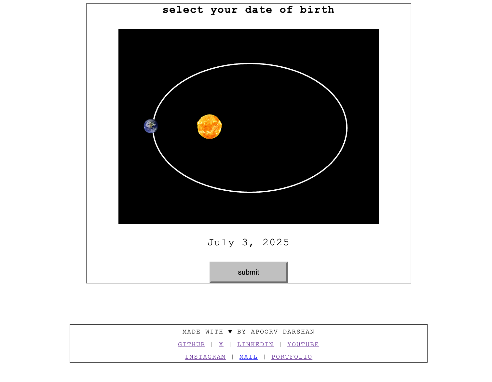

# The Most Astronomically Absurd Date Picker Ever Created

A date picker where you select your birth date by dragging Earth around the Sun in an elliptical orbit. Each complete orbit represents one year.

**🌍 [Live Preview](https://apoorvdarshan.github.io/dob-selector/)**

## Features

- Elliptical orbital mechanics following Kepler's Laws
- Drag Earth to change years (clockwise = forward, counterclockwise = backward)
- Mobile-friendly with touch controls
- Vintage computer terminal aesthetic

---

Made with ♥ by **Apoorv Darshan**

  
  
  
  
  
  
  

